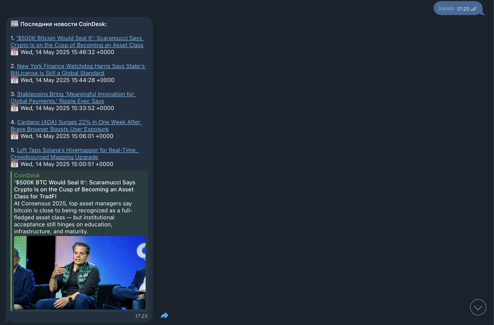
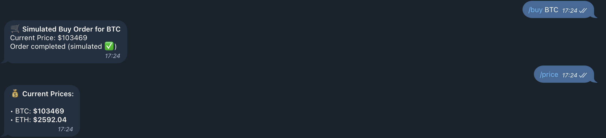

# Telegram Signal Bot – QA Testing Report

📋 **Manual QA testing of @SignalForgeBot – a Telegram crypto assistant.**  
Tested commands include `/news`, `/price`, and `/buy`.

🔗 Telegram Bot: [@SignalForgeBot](https://t.me/SignalForgeBot)

---

## 🔧 Tested Commands

### `/news`
- ✅ Retrieves top headlines from CoinDesk RSS
- ✅ Proper formatting of links, timestamps, and preview text
- ✅ Image and summary shown for the first article
- 🟡 No pagination or filter options

📸 Screenshot:  

---

### `/price`
- ✅ Fetches live BTC and ETH prices from CoinGecko
- ✅ Data is accurate and timestamped
- ✅ Displays formatted output with coin symbols

---

### `/buy BTC`
- ✅ Simulates a buy order for the provided symbol
- ✅ Shows confirmation, current price, and status
- 🔴 No validation for unsupported tokens (e.g. random string)

📸 Screenshot:  

---

## 🔁 How to Reproduce

1. Open [@SignalForgeBot](https://t.me/SignalForgeBot) in Telegram
2. Type `/news` → receive CoinDesk headlines
3. Type `/price` → get BTC and ETH prices
4. Type `/buy BTC` → see simulated trade confirmation

---

## ✅ Summary

| Area               | Result                              |
|--------------------|-------------------------------------|
| Functional testing | ✅ Passed                            |
| Error handling     | ⚠️ Limited (no input validation)     |
| UX / formatting    | ✅ Clear and user-friendly           |
| API data accuracy  | ✅ Matched CoinDesk & CoinGecko     |

---

## 🔒 Notes

- All tests were performed manually via Telegram on **14 May 2025**
- This is **not my development project**, only a QA case study
